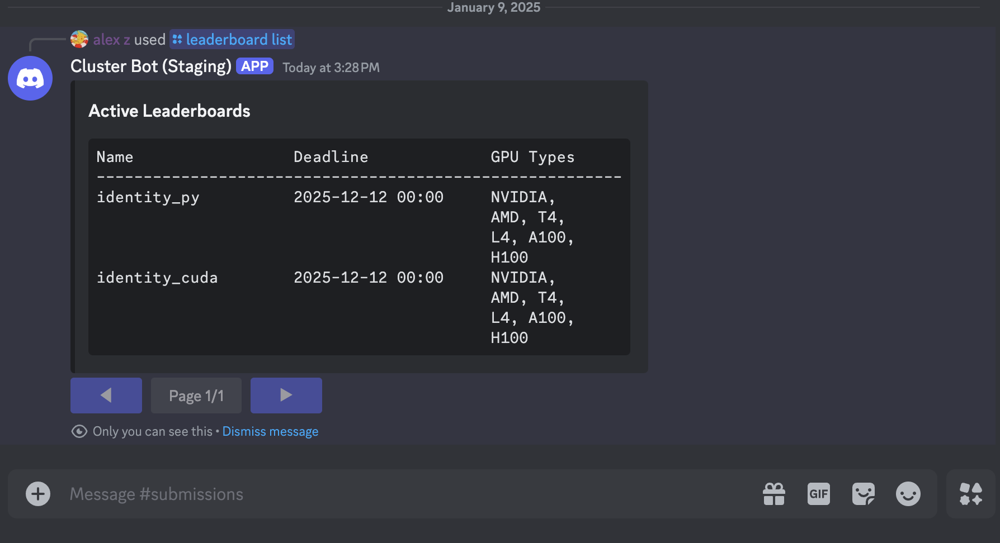

# Using the Discord Bot
I will write this guide under the assumption that the participant is not very familiar with Discord. For
the purposes of our leaderboard, all you need to understand is that a Discord server (e.g. GPU MODE)
has many text channels, which the participant can write on. Only one channel, the `#submissions`
channel, is needed for submitting and debugging kernels, but we will also discuss the benefit of other channels
for community-driven efforts.

These are text channels on Discord, located on the left-side of your client.

## Slash '/' Commands
You will communicate with the Discord bot using slash `/` commands on Discord, which basically just
means prefixing your messages with a forward slash `/`.

First, **open up the `#submission` channel and type `/leaderboard list`**. This is an example of a
`/` (*"slash"*) command, and is basically how you will communicate with our Discord leaderboard bot to submit 
kernels and view the leaderboards.

  

This will **display a list of the currently active leaderboards** that you can submit to. You can press
[Enter] to send the command to the bot. On the server side, the bot will retrieve a list of active
leaderboards from our database and display all available leaderboards on the same channel. *Notice
that these commands are only visible to the participant, so other participants will not be able to
see these commands*. You should see a list like so:

These are text channels on Discord, located on the left-side of your client.

  

Stay on the the `#submissions` channel on Discord -- while we allow other commands on any channel, we only
allow submission slash commands (e.g. `/leaderboard submit modal`) in this channel specifically. The
following two examples will be for the `identity_py` and `identity_cuda` leaderboards, which expect
the participant to submit a Python and CUDA kernel respectively that returns simply returns the
input. We will show you how to read the reference code to format your submission.
